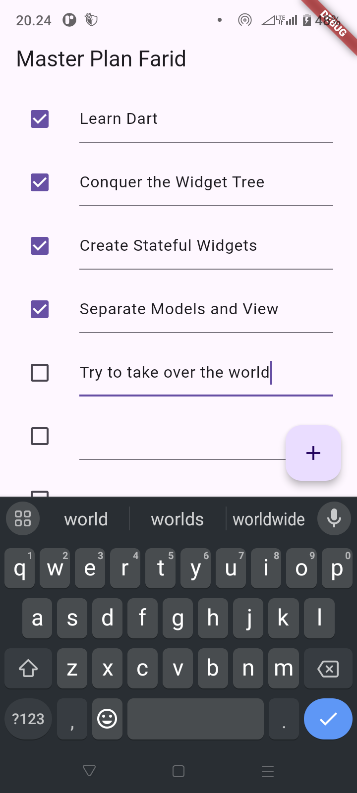
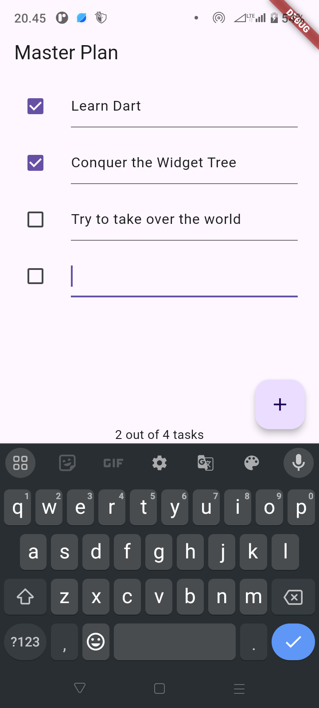
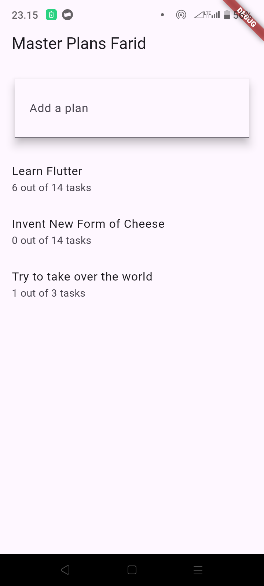

# Dasar Manajemen State di Flutter

```
Nama     : Farid Fitriansah Alfarizi
NIM      : 2241720055
Kelas    : TI-3A
```

# Tugas Praktikum 1: Dasar State dengan Model-View
1. Selesaikan langkah-langkah praktikum tersebut, lalu dokumentasikan berupa GIF hasil akhir praktikum beserta penjelasannya di file README.md! Jika Anda menemukan ada yang error atau tidak berjalan dengan baik, silakan diperbaiki.
2. Jelaskan maksud dari langkah 4 pada praktikum tersebut! Mengapa dilakukan demikian? \
Langkah 4 dalam praktikum tersebut bertujuan untuk membuat sebuah file bernama data_layer.dart yang berfungsi sebagai pusat ekspor untuk model-model data di aplikasi. Dengan membungkus plan.dart dan task.dart ke dalam satu file data_layer.dart, kita dapat mengelola dan mengakses model data dengan lebih efisien. Setiap kali model baru ditambahkan, kita hanya perlu menambahkan export di file ini tanpa harus mengimpor model satu per satu di berbagai file yang membutuhkan akses ke model tersebut.

3. Mengapa perlu variabel plan di langkah 6 pada praktikum tersebut? Mengapa dibuat konstanta ?
    - Pada langkah 6, variabel plan diperlukan untuk menyimpan instance dari kelas Plan, yang akan digunakan untuk menampilkan dan mengelola data rencana atau tugas di layar PlanScreen. Variabel ini bertindak sebagai model data yang digunakan oleh widget dalam PlanScreen untuk menampilkan informasi dan berinteraksi dengan data tersebut.

    - Variabel plan dibuat sebagai konstanta (const) untuk memberikan kepastian bahwa instance Plan tidak akan berubah setelah dibuat. Ini meningkatkan efisiensi dan mencegah perubahan yang tidak disengaja pada data di dalam PlanScreen. Karena Plan diinisialisasi tanpa nilai dinamis atau input dari pengguna, menandainya sebagai konstanta juga mengurangi penggunaan memori dan membantu menjaga kestabilan aplikasi.

4. Lakukan capture hasil dari Langkah 9 berupa GIF, kemudian jelaskan apa yang telah Anda buat!

    

5. Apa kegunaan method pada Langkah 11 dan 13 dalam lifecyle state ?
    - initState() dipanggil sekali, tepat setelah widget dibuat, untuk melakukan inisialisasi awal. Ini adalah tempat yang ideal untuk menginisialisasi variabel atau menetapkan listener.

    - dispose() dipanggil ketika widget dihapus atau tidak lagi digunakan. Ini adalah tempat untuk membersihkan atau menghentikan operasi yang tidak lagi diperlukan.

6. Kumpulkan laporan praktikum Anda berupa link commit atau repository GitHub ke dosen yang telah disepakati !

# Tugas Praktikum 2: InheritedWidget
1. Selesaikan langkah-langkah praktikum tersebut, lalu dokumentasikan berupa GIF hasil akhir praktikum beserta penjelasannya di file README.md! Jika Anda menemukan ada yang error atau tidak berjalan dengan baik, silakan diperbaiki sesuai dengan tujuan aplikasi tersebut dibuat.
2. Jelaskan mana yang dimaksud InheritedWidget pada langkah 1 tersebut! Mengapa yang digunakan InheritedNotifier?
    - Dalam kode pada Langkah 1, yang dimaksud dengan InheritedWidget adalah kelas PlanProvider, yang di sini merupakan turunan dari InheritedNotifier<ValueNotifier<Plan>>. InheritedWidget adalah kelas di Flutter yang memungkinkan kita untuk meneruskan data ke seluruh widget subtree (pohon widget) dan memungkinkan widget anak untuk "mendengarkan" perubahan data tanpa harus mengoper data tersebut secara eksplisit dari widget induk ke setiap widget anak.

    - Di langkah ini, PlanProvider menggunakan InheritedNotifier sebagai basisnya, bukan InheritedWidget secara langsung. InheritedNotifier adalah variasi khusus dari InheritedWidget yang berguna untuk menggabungkan konsep pemberitahuan (notifier) dan pengaksesan data di subtree.

3. Jelaskan maksud dari method di langkah 3 pada praktikum tersebut! Mengapa dilakukan demikian?
    1. completedCount
        - completedCount adalah sebuah getter yang menghitung jumlah tugas yang telah diselesaikan di dalam daftar tasks.

        - Dengan menambahkan completedCount, kita bisa dengan mudah mendapatkan jumlah tugas yang selesai tanpa harus menghitungnya secara manual setiap kali dibutuhkan. Ini membantu dalam menjaga kode tetap bersih dan efisien.

    2. completenessMessage        
        - completenessMessage adalah sebuah getter yang memberikan pesan tentang status kelengkapan tugas, menunjukkan berapa banyak tugas yang telah selesai dari total tugas yang ada.
        
        - Menambahkan completenessMessage memberikan cara yang sederhana dan konsisten untuk menampilkan informasi status kelengkapan tugas kepada pengguna. Dengan ini, kita tidak perlu membentuk pesan ini setiap kali dibutuhkan di bagian lain dari aplikasi, sehingga memudahkan pengembangan dan pemeliharaan.

4. Lakukan capture hasil dari Langkah 9 berupa GIF, kemudian jelaskan apa yang telah Anda buat!

    

5. Kumpulkan laporan praktikum Anda berupa link commit atau repository GitHub ke dosen yang telah disepakati !

# Tugas Praktikum 3: State di Multiple Screens
1. Selesaikan langkah-langkah praktikum tersebut, lalu dokumentasikan berupa GIF hasil akhir praktikum beserta penjelasannya di file README.md! Jika Anda menemukan ada yang error atau tidak berjalan dengan baik, silakan diperbaiki sesuai dengan tujuan aplikasi tersebut dibuat.
2. Berdasarkan Praktikum 3 yang telah Anda lakukan, jelaskan maksud dari gambar diagram berikut ini!

    

    ### Penjelasan Diagram
    1. Kiri (Sebelum Navigasi):
        - Hierarki di sebelah kiri menunjukkan struktur widget tree awal sebelum navigasi.
        - MaterialApp adalah widget utama yang menginisialisasi aplikasi.
        - Di dalam MaterialApp, terdapat PlanProvider, yang menyebarkan data Plan ke seluruh subtree.
        - PlanCreatorScreen adalah layar atau halaman yang menampilkan input form untuk membuat rencana.
          - Column digunakan untuk mengatur tata letak widget secara vertikal.
          - Di dalam Column, terdapat TextField untuk menerima input teks, dan Expanded yang membungkus ListView untuk menampilkan daftar item secara fleksibel di sisa ruang yang tersedia.

      2. Navigasi ke Layar Baru (Navigator Push):
          - Navigator Push adalah metode untuk melakukan navigasi ke layar lain di Flutter. Dalam hal ini, Navigator.push digunakan untuk berpindah dari PlanCreatorScreen ke PlanScreen.

      3. Kanan (Setelah Navigasi ke PlanScreen):
          - Setelah navigasi, aplikasi menampilkan layar baru, yaitu PlanScreen.
          - Di dalam PlanScreen, terdapat struktur Scaffold yang menyediakan dasar layout standar Flutter seperti AppBar, FloatingActionButton, dan lainnya.
          - Column di dalam Scaffold mengatur tata letak widget secara vertikal, sama seperti pada layar sebelumnya.
            - Expanded digunakan lagi untuk menampung ListView, yang memungkinkan daftar diperluas sesuai sisa ruang.
            - SafeArea digunakan untuk memastikan teks atau elemen lain tidak terpotong oleh notch atau area yang tidak aman di layar perangkat, seperti di bagian atas layar dengan status bar.

3. Lakukan capture hasil dari Langkah 14 berupa GIF, kemudian jelaskan apa yang telah Anda buat!

    

4. Kumpulkan laporan praktikum Anda berupa link commit atau repository GitHub ke dosen yang telah disepakati !