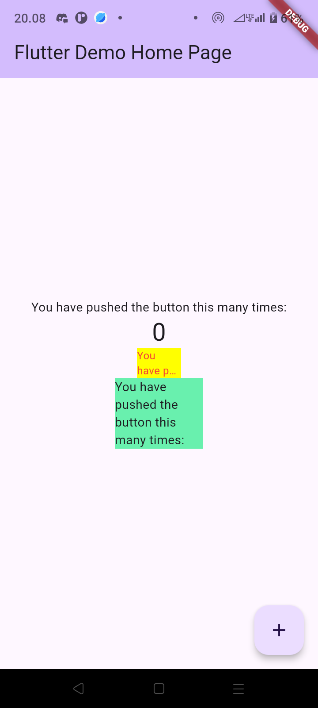

# Manajemen Plugin di Flutter

```
Nama     : Farid Fitriansah Alfarizi
NIM      : 2241720055
Kelas    : TI-3A
```

# Tugas Praktikum
1. Selesaikan Praktikum tersebut, lalu dokumentasikan dan push ke repository Anda berupa screenshot hasil pekerjaan beserta penjelasannya di file README.md!

    

2. Jelaskan maksud dari langkah 2 pada praktikum tersebut! \
Langkah 2 dalam praktikum tersebut bertujuan untuk menambahkan plugin auto_size_text ke proyek Flutter. Plugin ini memungkinkan penyesuaian ukuran teks secara otomatis sesuai dengan ruang yang tersedia, sehingga teks tidak terpotong dan tetap terlihat proporsional pada berbagai ukuran layar.

3. Jelaskan maksud dari langkah 5 pada praktikum tersebut! \
Langkah 5 pada praktikum tersebut bertujuan untuk menambahkan variabel text pada kelas RedTextWidget dan membuatnya dapat menerima nilai ketika objek dibuat. Ini dilakukan dengan menambahkan variabel text sebagai final agar nilainya tidak dapat diubah setelah diinisialisasi, lalu mendefinisikannya sebagai parameter yang dibutuhkan di constructor.

4. Pada langkah 6 terdapat dua widget yang ditambahkan, jelaskan fungsi dan perbedaannya!
    - Container Pertama
        - Fungsi: Menampilkan teks yang telah dikustomisasi melalui widget RedTextWidget, yang menerima teks sebagai parameter.
        - Perbedaan: Karena RedTextWidget adalah widget khusus, kita dapat menambahkan fitur tambahan pada teks, misalnya mengatur warna teks atau ukuran dinamis (misalnya dengan auto_size_text yang ditambahkan sebelumnya). Dalam konteks ini, RedTextWidget memberikan kontrol lebih untuk menyesuaikan tampilan teks dibandingkan widget teks standar.
        
    - Container Kedua
        - Fungsi: Menampilkan teks menggunakan widget Text, yaitu widget dasar Flutter untuk menampilkan teks.
        - Perbedaan: Tidak memiliki kustomisasi yang disediakan RedTextWidget. Widget Text menampilkan teks secara langsung tanpa modifikasi khusus dan digunakan untuk tampilan teks sederhana.

5. Jelaskan maksud dari tiap parameter yang ada di dalam plugin auto_size_text berdasarkan tautan pada dokumentasi ini !
    - text:
    Teks yang akan ditampilkan. Parameter ini wajib diisi, seperti halnya widget Text standar.
    - style:
    Menentukan gaya teks (misalnya, warna, ukuran awal, font, berat font). Jika tidak diatur, auto_size_text akan menggunakan gaya bawaan dari tema aplikasi.
    - maxLines:
    Menentukan jumlah maksimal baris yang dapat digunakan untuk menampilkan teks. Jika teks melebihi jumlah baris ini, auto_size_text akan menyesuaikan ukuran teks agar muat dalam batas ini.
    - minFontSize:
    Menetapkan ukuran font minimum yang akan dicoba oleh auto_size_text saat mengurangi ukuran teks. Jika ukuran teks mencapai batas ini dan masih tidak muat, teks akan dipotong atau terpotong.
    - maxFontSize:
    Ukuran font maksimum yang dapat digunakan oleh auto_size_text. Secara default, ukuran font ini diatur ke ukuran font awal yang diberikan di dalam style.
    - stepGranularity:
    Menentukan seberapa besar atau kecil perubahan ukuran font saat menyesuaikan teks. Nilai ini menentukan penurunan ukuran font dalam unit piksel. Misalnya, jika diatur ke 2, maka ukuran font akan berkurang dua piksel per langkah hingga mencapai batas minimum.
    - group:
    Menyediakan cara untuk mengatur beberapa widget AutoSizeText dalam satu grup agar memiliki ukuran font yang sama. Berguna jika Anda ingin beberapa teks memiliki ukuran yang konsisten dalam tampilan yang sama.
    - presetFontSizes:
    Daftar ukuran font yang ingin diuji oleh auto_size_text dalam urutan tertentu. Ini memberi kendali penuh atas ukuran font yang akan dicoba untuk digunakan.
    - overflowReplacement:
    Sebuah widget alternatif yang akan ditampilkan jika teks tetap tidak muat bahkan pada ukuran minimum. Parameter ini memungkinkan Anda menampilkan teks pengganti atau ikon jika teks tidak dapat diperkecil lebih lanjut.
    - wrapWords:
    Menentukan apakah kata akan dipotong atau dibungkus ketika menyesuaikan ukuran font. Jika diatur ke true, kata-kata akan dipotong di tengah jika diperlukan, namun ini tidak berlaku jika maxLines adalah 1.

6. Kumpulkan laporan praktikum Anda berupa link repository GitHub kepada dosen!