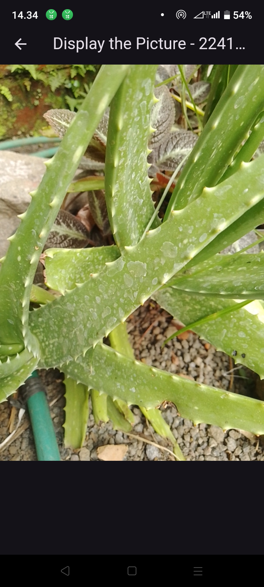

# Kamera

```
Nama     : Farid Fitriansah Alfarizi
NIM      : 2241720055
Kelas    : TI-3A
```

# Tugas Praktikum
1. Selesaikan Praktikum 1 dan 2, lalu dokumentasikan dan push ke repository Anda berupa screenshot setiap hasil pekerjaan beserta penjelasannya di file README.md! Jika terdapat error atau kode yang tidak dapat berjalan, silakan Anda perbaiki sesuai tujuan aplikasi dibuat!

    ## Praktikum 1
    

    

    ## Praktikum 2
    

    

2. Gabungkan hasil praktikum 1 dengan hasil praktikum 2 sehingga setelah melakukan pengambilan foto, dapat dibuat filter carouselnya!

    

    

    

3. Jelaskan maksud void async pada praktikum 1?
    - void: \
    void digunakan sebagai tipe pengembalian dari fungsi tersebut, yang berarti bahwa fungsi ini tidak mengembalikan nilai apa pun. Di Dart, jika sebuah fungsi memiliki tipe pengembalian void, itu menunjukkan bahwa fungsi hanya melakukan tugas tertentu tanpa menghasilkan data yang perlu dikembalikan.

    - async:
        - async digunakan untuk menandai bahwa fungsi tersebut adalah fungsi asinkron. Dalam Dart, fungsi asinkron memungkinkan kita menunggu tugas yang memerlukan waktu (misalnya, pengambilan data dari kamera atau internet) tanpa menghalangi alur program.
        - Ketika sebuah fungsi diberi label async, maka fungsi tersebut dapat menggunakan kata kunci await di dalamnya untuk menunggu penyelesaian operasi asinkron sebelum melanjutkan ke baris kode berikutnya. Ini membantu agar program tidak "terhenti" saat menunggu tugas selesai.

4. Jelaskan fungsi dari anotasi @immutable dan @override ?
    - @immutable \
    Anotasi @immutable menandakan bahwa objek atau kelas yang ditandai sebagai immutable tidak dapat diubah setelah dibuat (tidak mutable). Ini berarti bahwa semua properti kelas tersebut harus bersifat final, sehingga nilainya tidak bisa diubah setelah objeknya dibuat.

    - @override \
    Anotasi @override menunjukkan bahwa metode atau properti dalam sebuah kelas merupakan implementasi ulang (override) dari metode atau properti yang didefinisikan dalam kelas induknya.

5. Kumpulkan link commit repository GitHub Anda kepada dosen yang telah disepakati!